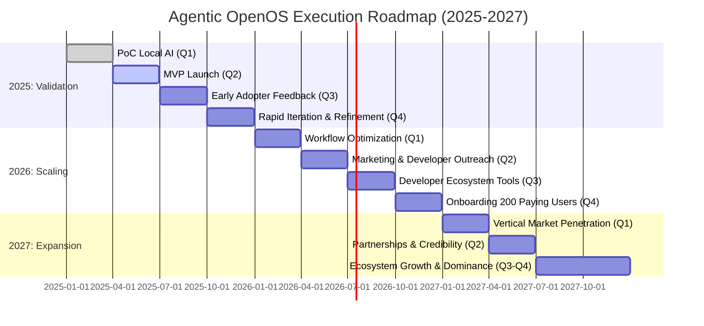

# **Agentic OpenOS: A Local AI Platform for Innovators**

## **Mission**
Agentic OpenOS exists to empower developers and creators with a privacy-first, offline AI platform. By prioritizing user data ownership and local processing, we aim to create tools that are not only powerful but also secure, giving users the confidence to innovate freely.

---

## **Core Principles**

1. **User Obsession:**  
   Build products users love, solving their most pressing problems in elegant, efficient ways. Aim for a product that inspires advocacy through exceptional user experiences.

2. **Focus and Simplicity:**  
   Solve one problem extremely well before expanding. Every feature and system must serve a clear purpose. Complexity is the enemy.

3. **Rapid Iteration:**  
   Launch fast, gather user feedback, and improve continually. A 5% weekly improvement compounds into transformative growth.

4. **Privacy by Design:**  
   Commit to keeping user data local, encrypted, and secure. Build trust through transparency and robust security measures.

5. **Execution Over Ideation:**  
   Execution is the differentiator between great ideas and successful companies. Focus on measurable results and progress.

---

## **Objectives**

### **2025: Build and Validate**
- **Goal:** Deliver an MVP that processes data locally with minimal latency and maximum security.  
- **Metrics:**
  - Achieve <10-second processing for common workflows.  
  - Secure 5–10 pilot users and iterate based on feedback.

### **2026: Scale Adoption**
- **Goal:** Expand user base, refine the product, and establish developer evangelism.  
- **Metrics:**  
  - Achieve $50k MRR by onboarding 200 paying users.  
  - Foster a community of 500+ developers contributing extensions or plugins.

### **2027: Dominate and Diversify**
- **Goal:** Become the default solution for local AI across industries.  
- **Metrics:**  
  - Expand into vertical markets with 1,000+ paying users and $5M ARR.  
  - Launch an ecosystem of modular extensions built by both the core team and external contributors.

---

## **Execution Roadmap**

### **2025: Validation**
1. Develop a proof-of-concept (PoC) to validate local AI processing capabilities.  
2. Launch a minimal MVP targeting high-value, privacy-sensitive use cases.  
3. Engage early adopters for direct feedback and iterate rapidly.

### **2026: Scaling**
1. Optimize core workflows for speed and reliability.  
2. Launch marketing efforts targeting developers and privacy-conscious industries.  
3. Introduce API documentation and developer-friendly tooling to expand the ecosystem.

### **2027: Expansion**
1. Scale beyond early adopters into diverse verticals like finance, legal, and beyond.  
2. Build strategic partnerships to enhance distribution and credibility.  
3. Transition from product-market fit to market dominance by focusing on user retention and ecosystem growth.

---

## **Tech Stack (Lean JS-Centric Approach)**

- **Backend**:  
  - **Node.js + Express** for quick development and minimal overhead.  
  - **Local Inference**: Integrate local AI libraries (e.g., `nodellama`, GPU-accelerated Node bindings, or custom wrappers) to keep data processing offline whenever possible.  
  - **Data Store**: Start with a lightweight local DB (e.g., SQLite) or JSON-based store for prototyping, scaling to Postgres or MongoDB only if demand grows significantly.

- **AI Models**:  
  - Locally deployed **optimized LLMs** or specialized transformers (via Node modules or bridging to C++ libs).  
  - Emphasize privacy and offline operation, with optional hooks for partial cloud usage if enterprise needs it.

- **Frontend**:  
  - **React** or another lightweight JS framework (Vue, Svelte) for minimal, responsive UIs.  
  - Keep complexity low: prefer single-page or minimal routes to ensure fast iteration.

- **Deployment & Hosting**:  
  - **Local-first**: Provide a Node-based Docker image or easily distributable build for entirely offline use.  
  - **Optional Cloud**: For users who desire it, a single-instance deployment on Heroku, AWS ECS, or Vercel.  

- **Security & Privacy**:  
  - Emphasize offline mode with local encryption (stored secrets in `.env` or environment variables).  
  - Use HTTPS (locally with self-signed certs) to secure front-end–backend interactions.

- **Tooling & Ecosystem**:  
  - A **CI/CD** pipeline (e.g., GitHub Actions) for test/build/deploy.  
  - API-first design so developers can build plugins or extensions around the Node-based platform.

---

## **Metrics for Success**

- **User Retention:** Ensure 80%+ retention in the first 6 months.  
- **Performance:** <10-second processing time for standard tasks.  
- **Revenue:** Achieve $5M ARR by the end of 2027.  
- **Community Growth:** Onboard 1,000+ active contributors to the developer ecosystem.

---

## **Guiding Philosophy**
- **Start Small:** Solve one clear, urgent problem better than anyone else.  
- **Do Things That Don’t Scale:** Engage early users directly, gather insights, and refine relentlessly.  
- **Focus on Love, Not Likes:** Build a product that a small group of users can’t live without before expanding.  
- **Execution Wins:** The startup graveyard is full of ideas that lacked follow-through.

---

## **Gantt Chart: 2025–2027 Execution Timeline**

Below is a **high-level** Gantt chart in Mermaid format, depicting the three main phases (Validation, Scaling, Expansion) and key milestones:

- **Validation (2025)**: PoC, MVP, gather 5–10 pilot users, <10-second local AI processing.  
- **Scaling (2026)**: Focus on marketing, community building, and hitting $50k MRR with 200 paying users.  
- **Expansion (2027)**: Diversify into more verticals, surpass 1,000+ users, and aim for $5M ARR.