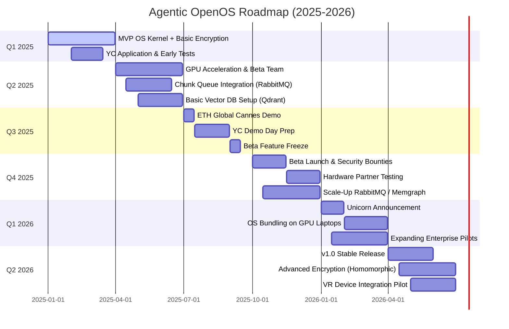

# **Agentic OpenOS: A Time-Based Epic**

## **EPISODE 1: THE MIDNIGHT IDEA (January 2025)**

**Scene:** Efe, a tech consultant in Istanbul, is coding past midnight.  
He has an **aha** moment: build an **operating system** that runs **AI agents locally**, with a **client-side encrypted graph** for user data. Why?

1. **Privacy & Ownership**: Users keep data on their machine, encrypt everything locally, and only share minimal metadata.  
2. **AI Evolution**: By 2025, Sam Altman predicts AI agents will join the workforce. Efe wants to ensure these agents run in a **secure, offline-first** environment.  
3. **Iterative Release**: Inspired by Altman’s viewpoint—AI must be tested in real-world increments. Efe envisions shipping features in small, **quarterly sprints**.

**Quantifiable Goals for Q1 2025**:

- **SMART Objective #1**: Create a minimal Linux-based OS kernel with GPU support, tested on at least **2 distinct GPU models**.  
- **SMART Objective #2**: Build an **MVP** that encrypts at least **1MB** of graph data in the client browser, chunked and queued to a Node.js server.

**Plot Twist**: Efe sees an impending Y Combinator deadline. He decides to apply with his rough MVP—and references Sam Altman’s iterative philosophy to convey big potential.

---

## **EPISODE 2: THE ACCELERATOR GAMBLE (Q2 2025)**

**Scene:** YC accepts Efe’s pitch, intrigued by the privacy-first OS concept.

1. **Team Formation**:  
   - **Hakan (AI Engineer)** to integrate GPU acceleration.  
   - **Leyla (UI/UX)** to handle chunk encryption flows.  
   - **Arif (Security/Blockchain)** to embed a crypto wallet at the OS level.  

2. **Architecture Layout**:  
   - **Chunk Queue**: RabbitMQ to process partial metadata or embeddings.  
   - **Vector DB**: Qdrant for semantic search.  
   - **Graph DB**: Memgraph for real-time relationships.  
   - **REST API**: Node.js for back-and-forth communication from the OS.  
   - **Client Encryption**: WebCrypto or a library like libsodium in a JavaScript SDK.

**Quantifiable Goals for Q2 2025**:

- **SMART Objective #1**: Achieve a stable OS build that can boot on **at least 5** different hardware setups with GPU inference capabilities tested on **NVIDIA DIGITS** or equivalent.  
- **SMART Objective #2**: Run a **successful alpha test** with **10 external** testers, each uploading encrypted data chunks (>10MB total) to the server.

**Plot Twist**: YC schedules Demo Day for late Q3. Efe must move fast, shipping updates every 2 weeks, aligning with Sam Altman’s “release rapidly and adapt” advice.

---

## **EPISODE 3: THE CANNES CRUCIBLE (Q3 2025)**

**Scene:** Efe sponsors a booth at **ETH Global** in Cannes to woo crypto-savvy devs.

1. **Demo Highlights**:  
   - Local AI inference analyzing hackathon data **offline**.  
   - A **built-in wallet** allowing token purchases without separate apps.  
   - User data remains encrypted (only partial embeddings are stored in Qdrant).

2. **Security Hiccup**: A wallet exploit emerges during the event. Arif patches it in hours, reinforcing the system’s **iterative** security model.

**Quantifiable Goals for Q3 2025**:

- **SMART Objective #1**: Onboard **50 beta testers** via the conference.  
- **SMART Objective #2**: Increase chunk-queue throughput by **2x** (handle **20MB** encrypted data in <1 minute per user).  
- **SMART Objective #3**: Present live demos to **at least 3** potential hardware partners.

**Plot Twist**: One major GPU-laptop brand shows real interest, wanting a pre-installed version if a stable Beta is ready by Q4.

---

## **EPISODE 4: SHOWTIME AT YC DEMO DAY (Late Q3–Early Q4 2025)**

**Scene:** YC Demo Day, a vital moment.

1. **Public Pitch**: Efe emphasizes Sam Altman’s iterative approach:  
   > “We build small, secure releases—encryption by default, offline AI usage, chunked data flows—so the world can adapt to advanced AI responsibly.”

2. **Investor Buzz**:  
   - A top VC invests \$10M at a \$100M valuation.  
   - Paul Graham tweets approval, praising real traction with **GPU-based local AI**.

**Quantifiable Goals for Early Q4 2025**:

- **SMART Objective #1**: Expand to **15-person** team, filling data engineering, devops, and security roles.  
- **SMART Objective #2**: Complete the Beta OS with **<5 critical** known bugs.  
- **SMART Objective #3**: Secure at least **2 letters of intent** from hardware partners or enterprise clients.

**Plot Twist**: The hardware manufacturer sets a Q4 deadline for a pre-install deal.

---

## **EPISODE 5: THE RACE TO BETA LAUNCH (Q4 2025)**

**Scene:** Efe’s team scrambles to finalize a Beta version.

1. **Core Feature Freeze**:  
   - No new features; focus on **GPU optimization** and **robust encryption** for the built-in wallet.  
   - Server side: scale RabbitMQ for enterprise usage, refine Memgraph indexes for real-time graph queries.

2. **Security Bounties**:  
   - The team offers **bug bounties** to root out wallet or encryption flaws.  
   - Weekly or bi-weekly patches ensure alignment with Sam Altman’s real-time “learn-by-doing” approach.

**Quantifiable Goals for Q4 2025**:

- **SMART Objective #1**: Achieve a stable Beta with **>=95%** test coverage on critical modules (encryption, chunk queue, wallet).  
- **SMART Objective #2**: Complete at least **2** successful pilot deployments with crypto-friendly coworking spaces (Bali, Lisbon).  
- **SMART Objective #3**: Publish an official **Beta release** for the hardware partner to test on GPU-laptops.

**Plot Twist**: A crypto fund hints at **\$50M** if the Beta performs well, pegging a potential unicorn valuation by year’s end.

---

## **EPISODE 6: THE UNICORN LEAP (Q1 2026)**

**Scene:** Press conference in Istanbul—**Agentic OpenOS** announces:

1. **\$50M Investment** at a **\$1B** valuation.  
2. **GPU-Laptop Bundle**: A dedicated hardware partner ships new devices with Agentic installed.  
3. **Enterprise & Crypto Growth**: Over 10k active Beta users, multiple large enterprise pilots.

**SMART Wins**:  
- All Q4 2025 goals met or exceeded.  
- Local AI inference shows 30% faster performance post GPU-laptop optimization.  
- Minimal user-churn—less than 10% alpha/beta testers drop off.

**Plot Twist**: An upcoming VR device integrator wants Agentic, foreseeing advanced AI agents in immersive experiences.

---

## **EPISODE 7: STABILIZING & SCALING (Q2 2026)**

**Scene:** The team moves from Beta to a stable V1.0:

1. **Refined Encryption**: Possibly incorporating partial homomorphic encryption to allow **some** on-server computations while still preserving user data privacy.  
2. **Full Memgraph Integration**: Deploy real-time analytics on user graphs for advanced offline AI logic.  
3. **Qdrant Scale-Out**: So that local embeddings (client-side) can sync with large enterprise clusters.

**Quantifiable Goals for Q2 2026**:

- **SMART Objective #1**: Surpass **50k** installed users across dev and enterprise segments.  
- **SMART Objective #2**: Conduct a **regional pilot** for VR integration, demonstrating local AI for at least **20 VR devices**.  
- **SMART Objective #3**: Offer **enterprise-grade** SLA with 99.9% queue uptime and <24-hour patch cycle for critical bugs.

**Plot Twist**: Sam Altman publicly endorses the project’s approach, reinforcing the notion that real-time, iterative updates remain key to AI alignment.

---

# **Mermaid Gantt Chart** 

Below is a **time-based, quarter-by-quarter** chart (Q1 2025–Q2 2026), depicting major feature milestones.

---

# **In Summary**

1. **Time-Based Execution**: Each quarter focuses on **SMART objectives**—clear metrics on user counts, encryption coverage, or partner deals.  
2. **Mermaid Gantt Chart**: Illustrates key development milestones from Q1 2025 to Q2 2026, ensuring the project’s trajectory is visually trackable.  
3. **Rationale**: Sam Altman’s iterative AI philosophy underpins the plan—Agentic OpenOS grows in small, safe increments, letting real-world testers shape security and feature expansions.  
4. **Attainability & Reliability**:  
   - **Attainable**: Each quarter’s goals (like 10 testers in Q2, 50 in Q3, 10k by Q1 2026) scale at a realistic pace for a startup.  
   - **Reliable**: Frequent bug bounties, short patch cycles, and queue-based architecture ensure system resilience.

The final outcome by mid-2026: **Agentic OpenOS** stands as a **unicorn** bridging local AI inference, encrypted user graphs, and the unstoppable march of advanced AI agents—fully aligned with the real-time “safe release” approach Sam Altman endorses.