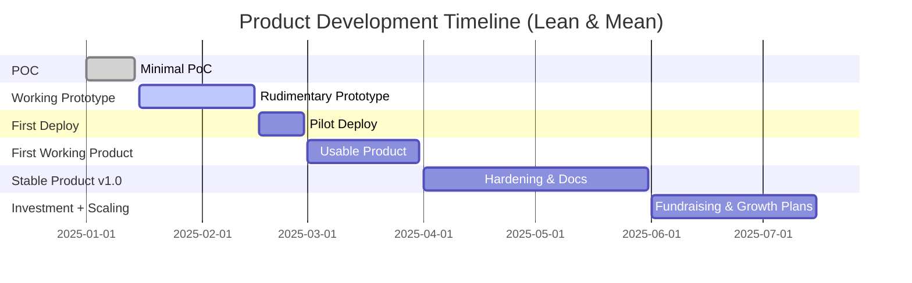

Below is an **updated version** of the product scope plan, **including** specific **tech stack details** in each stage—and a **big reminder** to stay **soooo lean** (no over-engineering, no trying to build "Google in your backyard" from day one!). The goal is to deliver real value ASAP, then evolve as traction grows.

---

## **1. Proof of Concept (POC)**
**Goal:** Validate the *core concept* or technology feasibility—**extremely lean**, minimal code.

**Timeline:** ~2–4 weeks (short, focused).

**Tech Stack (Minimal):**
- **Backend**:  
  - Use a **script or simple micro-framework** (e.g., Flask for Python, Express.js for Node).  
  - If you need AI, **call a small local model** or a basic cloud AI API. (No advanced orchestration; keep it *tiny*.)  
- **Storage**:  
  - **Skip** big DB setups; store data in a **lightweight** local file or in-memory cache.  
  - If absolutely necessary, a single, quick-to-set-up DB (like SQLite or a free-tier Postgres).
- **Infrastructure**:  
  - **Local environment** or a free-tier cloud instance.  
  - No complex Docker Compose or Kubernetes—**just run your script**.

**Key Deliverables:**
- **Technical Validation**: Prove that your chosen approach (AI model, unique algorithm, etc.) actually works.  
- **Simple Demo**: Possibly a command-line or a single webpage that shows the concept.  
- **Feasibility Notes**: Summarize any performance constraints or next-step requirements.

**Do NOT**:
- Over-engineer. **No** multi-cloud architecture, **no** load balancers for day one. **Remember**: *Don't build Google in your garage*.

---

## **2. Working Prototype**
**Goal:** Turn the POC into a *rudimentary, user-interactive* prototype. Keep it small, still **super lean**.

**Timeline:** ~4–8 weeks post-POC.

**Tech Stack (Incremental additions):**
- **Backend**:  
  - Stick with the same micro-framework or script from the POC.  
  - If you need additional libraries (e.g., websockets, job schedulers), **add them only if absolutely needed**.
- **Frontend** (if required):  
  - A minimal single-page app or static site using something like **React** (Create React App) or **Next.js** if you want SSR.  
  - Keep the codebase under tight scope—**no** 50-component spree.
- **Storage**:  
  - Possibly upgrade to a basic managed DB (e.g., free-tier Postgres or Mongo) if you need to persist data properly.  
  - If AI is storing embeddings, consider a small local store or a single collection in your DB—**no** giant vector DB cluster yet.
- **Hosting**:  
  - Could host prototype on **Heroku free tier** (or any low-tier cloud) with a single dyno/instance.  
  - *No fancy autoscaling*—just be able to share a URL with testers.

**Key Deliverables:**
- **User Flows**: 1–2 essential workflows in a clickable UI or minimal API.  
- **Early Feedback**: Real user testing from small beta group.  
- **Architecture Draft**: 1–2 pages of "how it's wired together," but still minimal.

**Do NOT**:
- Add 20 microservices or 5 new frameworks. Keep it unbelievably **basic**.

---

## **3. First Deploy**
**Goal:** Put the prototype *somewhere live*—a staging or dev environment so pilot users can access externally.

**Timeline:** ~2–4 weeks after the working prototype is "usable."

**Tech Stack (Deployment-Focused, Still Lean):**
- **Backend**:  
  - Continue using the single micro-framework instance.  
  - Optionally containerize with a **single Dockerfile**, but avoid multi-container complexity.
- **Frontend** (if you have one):  
  - Deploy static files on something like **Vercel** or Netlify, or serve them from the same backend.  
- **DevOps**:  
  - Use a **minimal** CI/CD: maybe GitHub Actions or simple push to Heroku.  
  - Logging? A basic console log or a single-file log. No full-blown logging aggregator yet.

**Key Deliverables:**
- **Hosted/Staging Environment**: A unique URL testers can visit.  
- **Basic Onboarding**: For example, a minimal sign-up or prompt for an API key.  
- **Feedback Loop**: Slack channel, email, or bug-tracking to capture issues.

**Do NOT**:
- Launch 5 AWS microservices or set up complex autoscaling.  
- Attempt a "global CD" with edge networks in 12 regions. Keep it single region, single instance.

---

### **(Problem–Solution Fit Found)**
You see **real** pilot usage and user willingness. Minimal but repeated use signals *you're solving an actual problem*. They can live without Google-scale reliability, but they need your solution consistently.

---

## **4. First Working Product**
**Goal:** Evolve the prototype into a *day-to-day usable product* for pilot customers. STILL keep it small. Don't bloat.

**Timeline:** ~4–6 weeks (can vary).

**Tech Stack (Slight Hardening):**
- **Backend**:  
  - Possibly add **one** more library or refactor code for clarity.  
  - If AI features are crucial, pick a stable model hosting approach—maybe a single GPU instance or continuing with an external API. **No** cluster orchestration yet.
- **Frontend**:  
  - If user flows expand, add minimal React components or hooks.  
  - For styling, use a lightweight library (e.g., Tailwind or Chakra) but stay minimal.
- **Data Management**:  
  - If pilot usage is heavier, ensure your single DB can handle it. Maybe scale from Heroku's free-tier to a basic paid plan.  
  - Keep schema changes straightforward, no complex data migrations.
- **Monitoring**:  
  - Basic application logs, maybe a single low-tier APM (Application Performance Monitoring) service if critical.  
  - Crash notifications via Slack or email.

**Key Deliverables:**
- **Core Feature Set**: Enough to solve the main user problem daily.  
- **Performance Benchmarks**: Speed is "good enough" for pilot usage.  
- **Initial Docs**: Quickstart or small wiki for testers.  
- **Potential Paid Trials**: Possibly sign on 1–2 paying pilot customers (small revenue).

**Do NOT**:
- Spin up 10 separate services or advanced distributed caching.  
- Add complicated user roles or an entire devops pipeline unless absolutely demanded by users.

---

### **(Product–Market Fit Found)**
- Pilot customers or paying users keep using it. They see real value, *returning regularly.*  
- You're no longer *chasing* them; they're telling you more features or bigger scale *they* want.

---

## **5. Stable Product v1.0**
**Goal:** Move toward a *production-grade* release, robust enough for broader adoption. STILL not Google-scale, just stable enough for real customers.

**Timeline:** ~2–3 months post "First Working Product."

**Tech Stack (Production Hardening, but Lean):**
- **Backend**:  
  - Possibly adopt a **clean project structure** (e.g., separate routes/controllers, minimal service layers).  
  - 1–2 background job workers if needed, but still *monolithic or very close to it.*  
- **Frontend**:  
  - Polish existing flows. Possibly implement **basic error boundaries** or minimal offline strategies if needed.  
  - Document all major UI flows.  
- **Security & Compliance**:  
  - Implement basic user auth with salted hashing or a library-based solution (e.g., Passport.js or Auth0).  
  - For AI, ensure no raw user data is overexposed or left unencrypted.  
- **Monitoring**:  
  - If usage is growing, integrate a simple logging aggregator or a single metrics collector (e.g., Datadog or Sentry).  
  - Single region or single AZ is still fine—**avoid** multi-region complexities for now.
- **Documentation**:  
  - More robust docs: "How to integrate," "API references," quickstart tutorials, maybe a short FAQ.  
- **Support**:  
  - Decide on Slack channel, email, or a minimal ticket system. Devs do the support, so they glean direct feedback.

**Key Deliverables:**
- **Reliability**: Users can trust it not to crash daily.  
- **Documentation**: Enough for new teams to onboard themselves.  
- **Support & Maintenance**: Clear route for bug/issue reporting, hotfix processes, etc.

**Do NOT**:
- Attempt an entire multi-cloud failover strategy.  
- Overcomplicate. Keep it monolithic or near-monolithic.

---

## **6. Investment & Scaling Plans**
**Goal:** With v1.0 stable enough, you can pitch investors if needed and plan bigger expansions. **But** scaling only after real usage demands it!

**Timeline:** Starts once v1.0 shows traction; can overlap with final stabilizing.

**Tech Stack (Scalability, Step by Step):**
- **Backend**:  
  - Evaluate minimal scale approach (vertical scaling on a single cloud).  
  - Only add microservices if the single monolith is *truly buckling* under load.  
- **Frontend**:  
  - Possibly adopt advanced CI/CD if many merges happen daily.  
  - *Still minimal* in infrastructure—maybe a second staging environment if you need more QA.  
- **Data**:  
  - If you're pushing DB limits, consider a modest DB plan or read replicas. But avoid "Google-scale sharding."  
- **DevOps**:  
  - Potentially integrate container-based scaling if absolutely needed.  
  - A small Kubernetes cluster is permissible *only* if usage data demands it and your team can handle the overhead.

**Key Deliverables:**
- **Pitch Deck & Financials**: Show real usage metrics, growth, short-term roadmap.  
- **Hiring Roadmap**: Which roles? Typically, more devs or a DevRel if user community is big.  
- **Marketing & GTM**: Outline conferences, partnerships, or "developer evangelism" expansions.  
- **Roadmap v2.0**: Possibly deeper AI integrations, HPC workflows, or enterprise compliance (ISO, SOC2) if customers need it.

**Do NOT**:
- Blow your new funding on 15 new microservices and 5 new teams.  
- Re-architect everything prematurely. Keep it "**Soooo Lean**."

---

## **Final Timeline Example**

Here's a rough timeline in **Mermaid** form. Customize durations as needed, but the message stays: **start small** and **only expand** once usage justifies it.

*(Dates are placeholders; adapt them to your real schedule.)*

---

### **Key Takeaways: "Don't Build Google"**

1. **Keep Tech Simple**: Use minimal frameworks, single-service architecture, and free-tier or low-tier cloud resources until you have real usage.  
2. **Grow Only with Traction**: Each expansion—more DB capacity, more complex devops—should be triggered by actual user demand, not hypothetical.  
3. **Documentation & Support**: Even in early versions, guide users and gather their feedback. That's your best R&D.  
4. **Iterate Rapidly**: Make each milestone small, ship fast, get real feedback, then refine or pivot.

By following these **lean, incremental stages**, you'll avoid the classic founder trap of overbuilding. Instead, your energy goes to **actual user impact**. Good luck, and stay "soooo lean!"