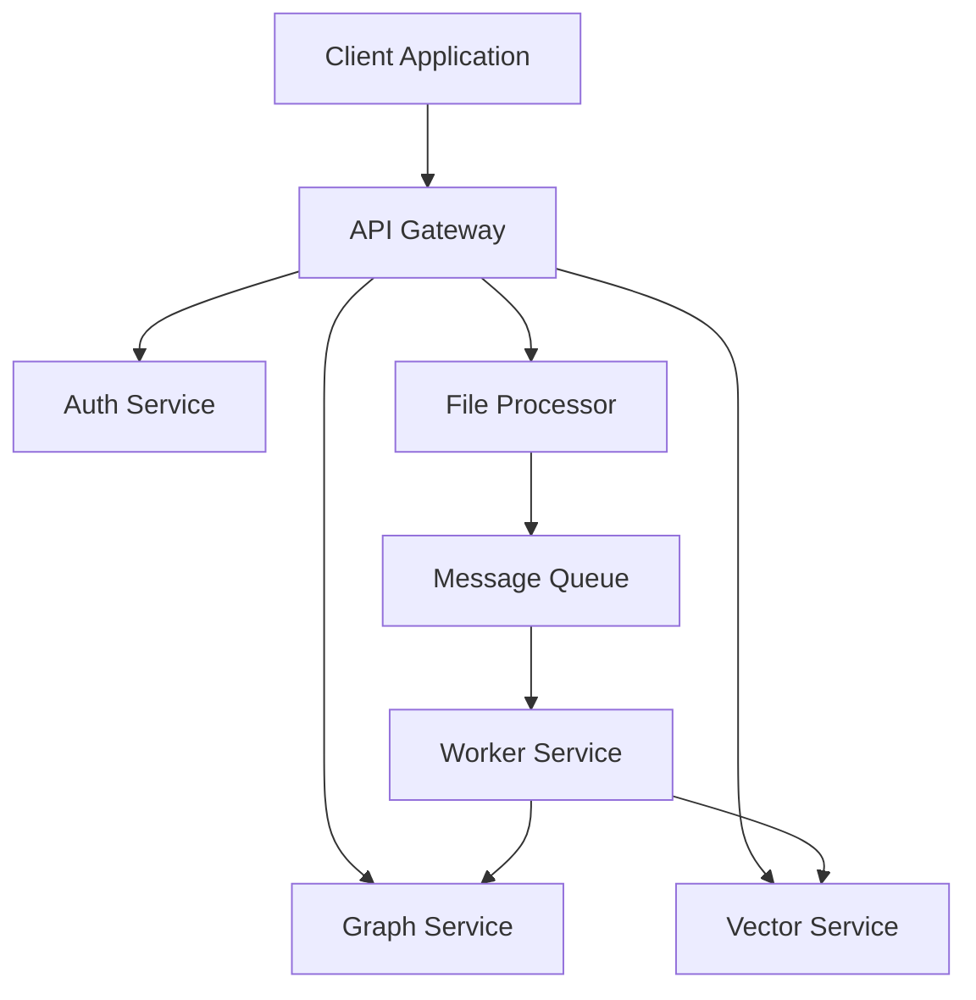
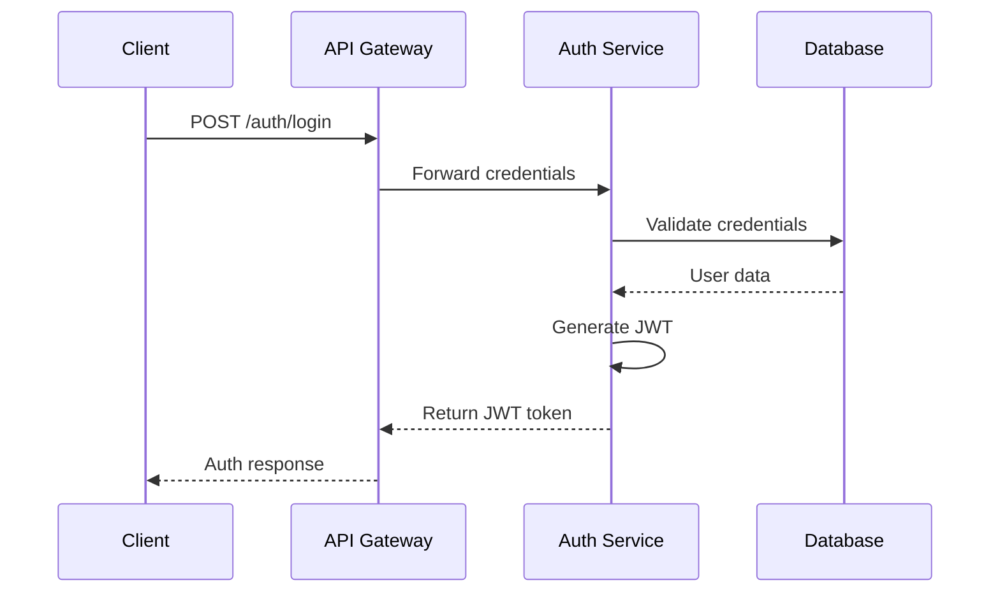
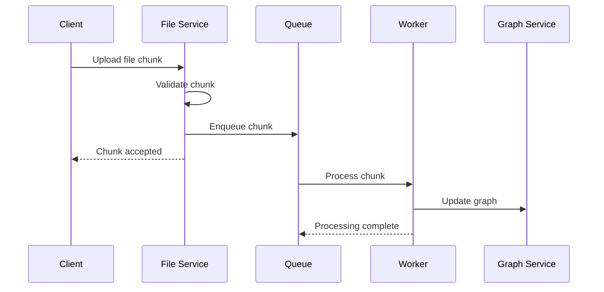
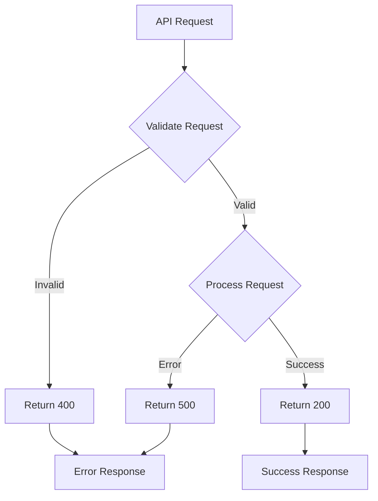
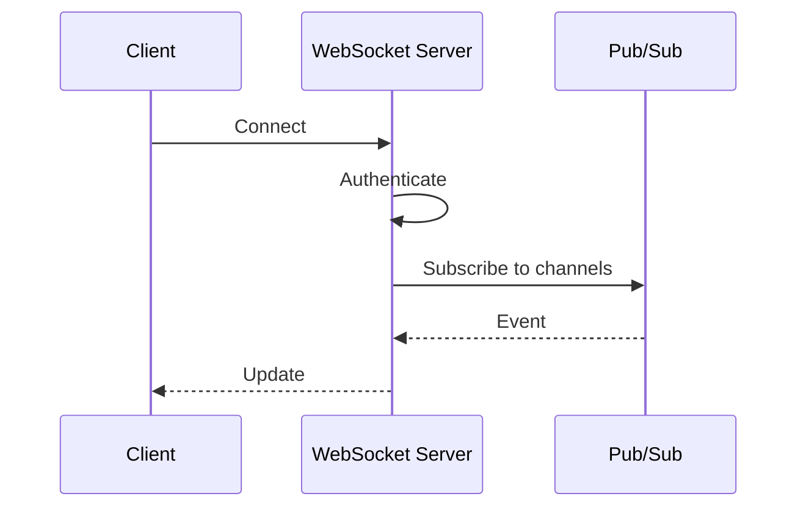
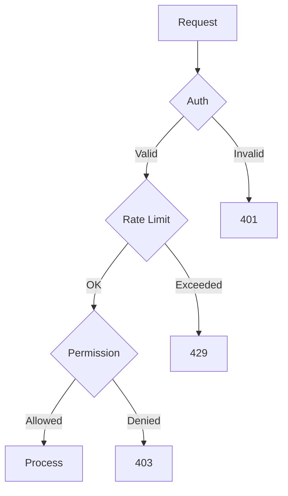

# API Reference Documentation

## Overview

This document provides comprehensive documentation for the API endpoints and flows across all microservices.

## System Architecture



## Authentication Flow



## File Upload Flow



## API Endpoints

### Authentication API

#### POST /auth/login
Authenticates a user and returns a JWT token.

**Request:**
```json
{
"email": "string",
"password": "string"
}
```

**Response:**
```json
{
"token": "string",
"refreshToken": "string",
"expiresIn": "number"
}
```

### File Processing API 

#### POST /files/upload
Initiates a new file upload session.

**Request:**
```json
{
"filename": "string",
"size": "number",
"type": "string"
}
```

**Response:**
```json
{
"uploadId": "string",
"chunkSize": "number",
"presignedUrls": ["string"]
}
```

### Graph API

#### GET /graph/nodes/{id}
Retrieves a graph node and its relationships.

**Response:**
```json
{
"id": "string",
"type": "string", 
"properties": {},
"relationships": []
}
```

## Error Handling



All API errors follow a standard format:

```json
{
"error": {
    "code": "string",
    "message": "string",
    "details": {}
}
}
```

## Rate Limiting

API requests are rate limited based on:
- 1000 requests per hour per IP address
- 10000 requests per hour per authenticated user

Rate limit headers included in responses:
```
X-RateLimit-Limit: 1000
X-RateLimit-Remaining: 999
X-RateLimit-Reset: 1618884730
```

## Versioning

The API uses path versioning:
- Current version: v1
- Example: `/api/v1/users`

Version changelog:
- v1: Initial release
- v1.1: Added pagination support
- v1.2: Enhanced error responses

## Pagination

All list endpoints support pagination using:
- `page`: Page number (default: 1)
- `per_page`: Items per page (default: 20, max: 100)

Response includes pagination metadata:
```json
{
"data": [],
"pagination": {
    "total": "number",
    "pages": "number",
    "current": "number",
    "per_page": "number"
}
}
```

## WebSocket APIs

Real-time updates use WebSocket connections:



WebSocket endpoints:
- `ws://api.example.com/v1/ws`

Event types:
- `graph.updated`
- `file.processed`
- `vector.indexed`

## API Security

Security measures implemented:



Security features:
- JWT authentication
- Request signing
- TLS 1.3
- CORS policy
- XSS protection
- CSRF tokens

